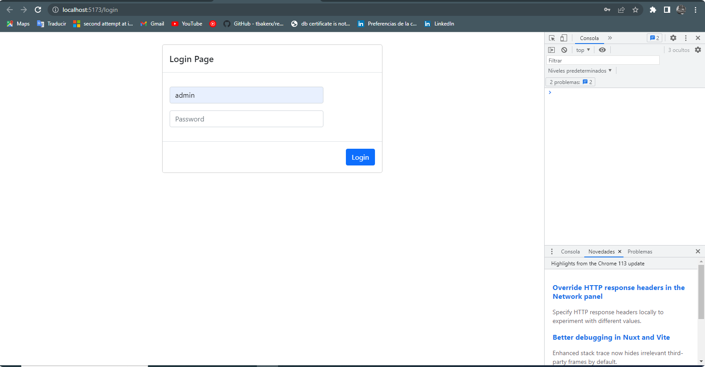
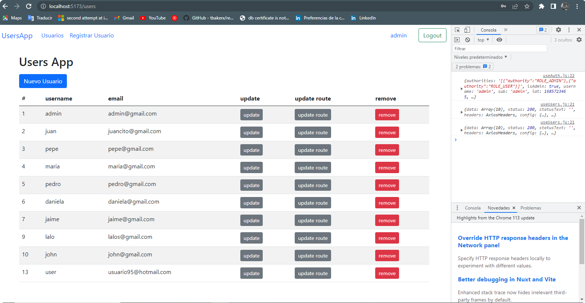
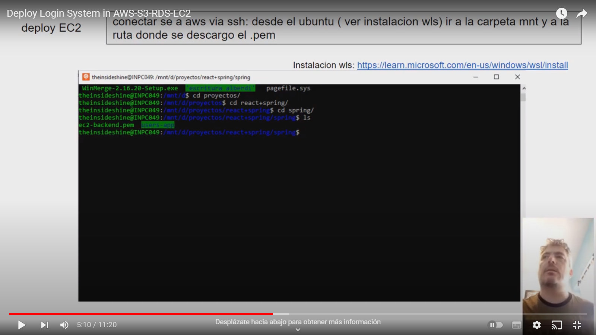

This project is a user login system with roles, the frontend is written with react using redux and the backend is written in java using spring security

The project is based on the course
https://www.udemy.com/share/108wH83@sUOci0WLaluOUSaQ3CDuW16yEIoNG97ElGCJM2o2Cbl8LXIRPxajjJwF8QlbhqDiEg==/

LoginPage

CrudUserPage

I used the aws-rds database resource, it took off the front on S3 and the backend on EC2

Deploy UsersApp

BackEnd repository: https://github.com/theinsideshine/backend-SpringSecurity-users-app 

